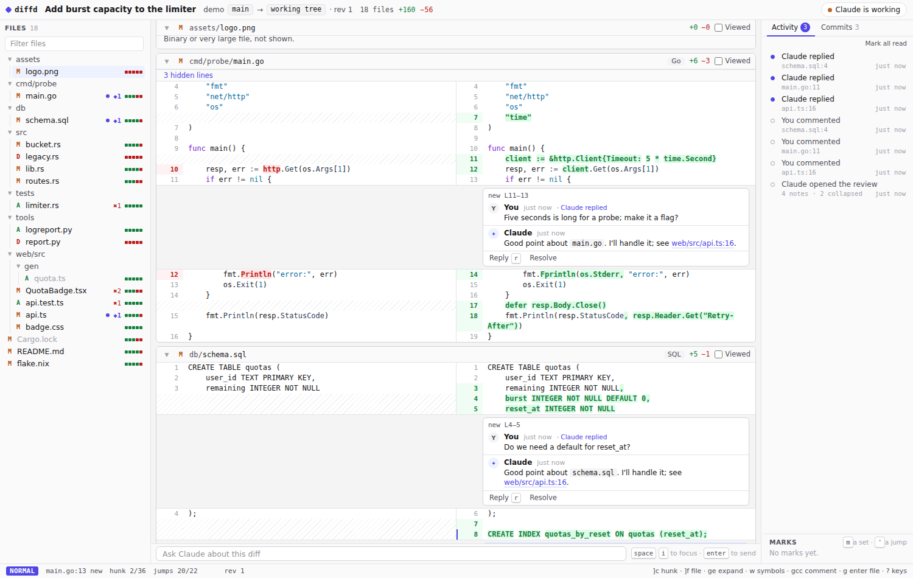

# diffd

A live code review of your agent's changes, in your browser.

Your agent (Claude Code, over MCP) shares a diff and gives you a link. You
read it in a fast, vim-driven, difftastic-powered split view, comment on
lines like on a pull request, and the agent answers inline while it keeps
working. The diff updates as the code changes. There's no "submit review":
the agent hears each comment once you pause.



- **Structural diffs** from [difftastic](https://difftastic.wilfred.me.uk/),
  with a plain line diff when a language isn't supported. Highlighting is
  done on the server with tree-sitter.
- **Talk about the code where it is.** Select lines, comment, and get a reply
  in the thread. A chat box covers everything else, and the agent can point
  you at code (it asks first; your scroll never jumps).
- **Agent-made structure.** Notes on tricky code, generated files and
  lockfiles collapsed, test code marked along the side, and uninteresting
  hunks folded behind a one-line summary.
- **Walk the history.** A review that spans commits can be read one commit
  at a time, or across any run of them.
- **Beyond the diff.** Open any file in the repository, comment on it, or
  let the agent show it to you.
- **Language servers.** Go to definition (`gd`), type definition (`gt`),
  hover docs (`K`) and red/yellow squiggles, for Rust, TypeScript, Python,
  Go, Nix, YAML or anything you configure.
- **Keyboard first**, mostly Zed's vim bindings: hunks, files, symbols, a
  jump list, marks, text objects, splits. Browser Ctrl+F works and finds
  folded lines too.
- **Built for big diffs** (100k lines) and flaky connections. Comments
  written offline are sent on reconnect, from any tab.

## Install

With Nix:

```sh
nix run github:404Wolf/diffd            # or: nix profile install github:404Wolf/diffd
```

From source, with Rust (1.85+), Node 22 and [just](https://just.systems):

```sh
just setup build        # target/release/diffd, with the page built in
```

diffd needs `git`. It uses `difft` (difftastic) when it's on your PATH, and
any language servers you have installed.

## Use it

```sh
diffd                   # start the server (http://localhost:3433)
diffd setup claude      # register it with Claude Code (once)
```

Then ask Claude to show you its changes ("share your changes with diffd").
It calls `share_diff` and gives you a link. Leave comments; Claude answers
in the threads. Press `?` on the page for every key.

### The MCP tools

| Tool | What it's for |
| --- | --- |
| `share_diff` | Start a review: `from`/`to` revisions (default: the working tree), a title and summary, notes on tricky code, files to collapse, test regions and folds. |
| `wait_for_feedback` | Wait for your comments and chat messages, batched once you pause. |
| `reply` | Answer in a thread, where the code is. |
| `say` | Answer in the chat. |
| `annotate` | Add notes, test marks or folds later. |
| `show` | Point you at some code, in the diff or anywhere in the repository. |
| `refresh` | Rebuild the review now (it also follows file changes by itself). |
| `get_review` | Everything about a review, for picking a conversation back up. |

### Keys you'll use most

| Keys | |
| --- | --- |
| `j` `k`, `]c` `[c`, `]f` `[f` | lines, hunks, files |
| `gcc`, `V` … `gc` | comment on a line, on selected lines |
| `r`, `space i` | reply to a thread, ask Claude anything |
| `gd`, `gt`, `K`, `grr` | definition, type definition, docs, references |
| `w` `b` | step through symbols on the line |
| `ctrl-o` `ctrl-i` | jump back and forward |
| `ge`, `zR` `zM` | expand folded lines, everything, back to hunks |
| `g enter`, `g space` | the plain file here, or in a split |
| `ctrl-\`, `ctrl-esc`, `ctrl-h` `ctrl-l` | split, close a split, move between splits |
| `]r` `[r`, `space c` | walk the commits |
| `ma`, `'a` | set a mark, jump to it |
| `vip`, `vaf`, `vi{`, `vat` | select a paragraph, function, block, tag |
| `]a`, `]n`, `]t` | Claude's notes, unread activity, threads |
| `space f`, `/`, `?` | go to file, search every line, all keys |

## Configure

`diffd config` prints the default configuration, with comments. Save the parts
you want to change as `~/.config/diffd/config.toml` (or pass `--config`); it's
merged over the defaults.

```toml
[server]
port = 3433

# Change one setting of a built-in language server...
[lsp.servers.rust-analyzer]
args = ["--log-file", "/tmp/ra.log"]

# ...turn one off...
[lsp.servers.yaml]
enabled = false

# ...or add another.
[lsp.servers.lua]
command = "lua-language-server"
languages = { lua = ["lua"] }
```

Language servers start in the reviewed repository (at the nearest project
root, e.g. the folder with `Cargo.toml`) when a review of the working tree
is open, several at once for mixed diffs, and stop when idle.

## How it's built

One Rust binary with the page baked in:

- `crates/diffd-core`: the model and wire protocol (exported to TypeScript
  with ts-rs), highlighting, symbols, difftastic parsing, the fallback line
  diff, anchoring.
- `crates/diffd-server`: use cases (`app/`) over ports (`ports.rs`) with
  adapters for git, difftastic, SQLite (sqlx), language servers, the file
  watcher, and the HTTP / WebSocket / MCP front doors.
- `crates/diffd`: the command line.
- `web/`: the page (SolidJS, Tailwind, Vite), built into one HTML file.
- `vendor/tungstenite`: Signal's tungstenite fork, for a compressed WebSocket.

[`docs/DESIGN.md`](docs/DESIGN.md) explains the design.

The server listens on localhost only, and refuses requests with a foreign
`Host` (DNS rebinding) or `Origin`.

## Develop

```sh
just                    # list recipes
just dev                # the server from source (rebuilds the page first)
just dev-web            # the page with hot reload, against `just dev`
just demo               # make a demo repository and share it with the running server
just check              # formatting, lints, types, unit and integration tests
just e2e                # the whole thing in a browser, with an MCP client as the agent
```

`just e2e` drives a real review end to end: Playwright plays you, a small
MCP client plays the agent, and it checks every surface (comments, chat,
splits, commits, language servers in six languages, offline and multi-tab,
reloads). SQL queries are checked at compile time; after changing one, run
`just sqlx`. After changing a type in `diffd-core`, run `just types`.

## License

MIT
